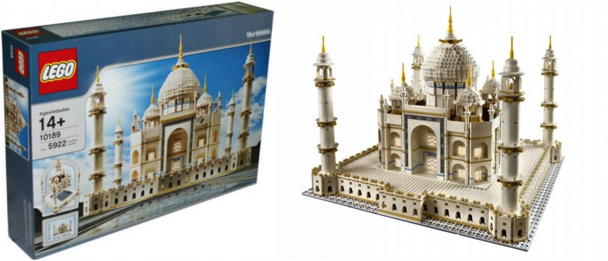
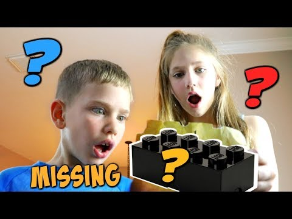
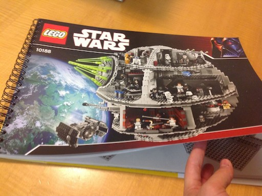
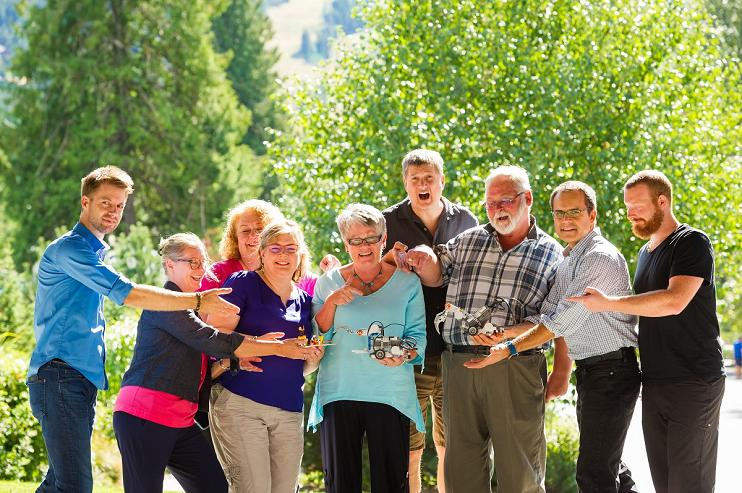
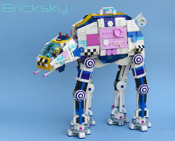
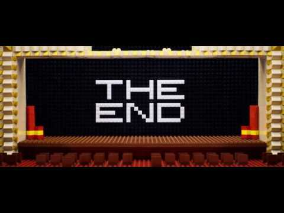

<!-- .slide: class="titlePage" data-state="titlePage" -->

## Revealjs &#10084; CF

#### How your slides become your CF demo

Note:
Originally I wanted to talk about pushing your presentation slide decks onto Cloud Foundry and what cool demo that can make. But when I was working on the sample slides, I noticed that they are way cooler than my original talk. So I made the sample slides my real talk. Here we go:

---
<!-- .slide: class="titlePage" data-state="titlePage" data-transition="zoom-in slide-out" data-transition-speed="slow"-->

## Lego and PCFS

#### Why building Lego makes me a better Solution Architect

---
<!-- .slide: data-state="normalPage" data-transition="slide" data-transition-speed="default" -->

## Start with what success looks like

---

## Don't panic when something is missing

---

## Following instructions yields good results

---

## More fun in a team

---

## But teaching requires patience... lots of patience

---

## Combining more than one thing can be awesome

---

## Enjoy what you are doing

---

